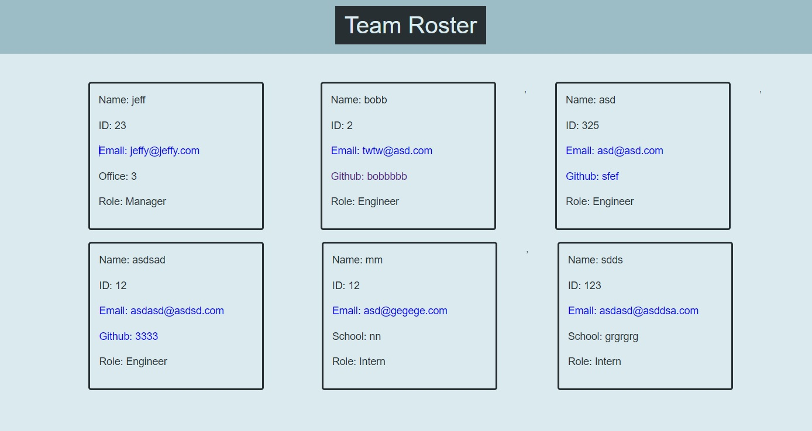

# Project 10

## [Video Demo](https://www.youtube.com/watch?v=K_aj33LZYHc)

## Description

In this project, I have created a script for node.js that takes  a list of employees and creates a webpage displaying all of their information and contact links. There are 3 different types of positions at the company, each with different pertinent information to be displayed. We can dictate how many engineer and intern positions to fill, but because leaders are by definition singular, the program assumes you have a single manager and does not leave the option to enter more currently.

We valid the email by using regular expressions as per [w3resource](https://www.w3resource.com/javascript/form/email-validation.php), and we validate the numerical inputs using !isNaN aka (its not a non-number)

## Usage 

After entering the manager's information, you are brought to a menu that asks you to choose between engineers, interns, and gives you the option to finish the input and move on. Each time an engineer or intern is entered into the system, the program asks you if you would like to enter another instance of the same job. If not, we are brought back to the menu, where we can either change roles or proceed with html generation. 

After receiving the information about the team, the program then generates the html, utilising flexbox to display our cards dynamically depending quantity.
Then we write the html to our dist/ folder before copying the stylesheet.

## Screenshots

## Resources used:

[This stackoverflow post](https://stackoverflow.com/questions/46155/how-to-validate-an-email-address-in-javascript)
[w3resource](https://www.w3resource.com/javascript/form/email-validation.php)